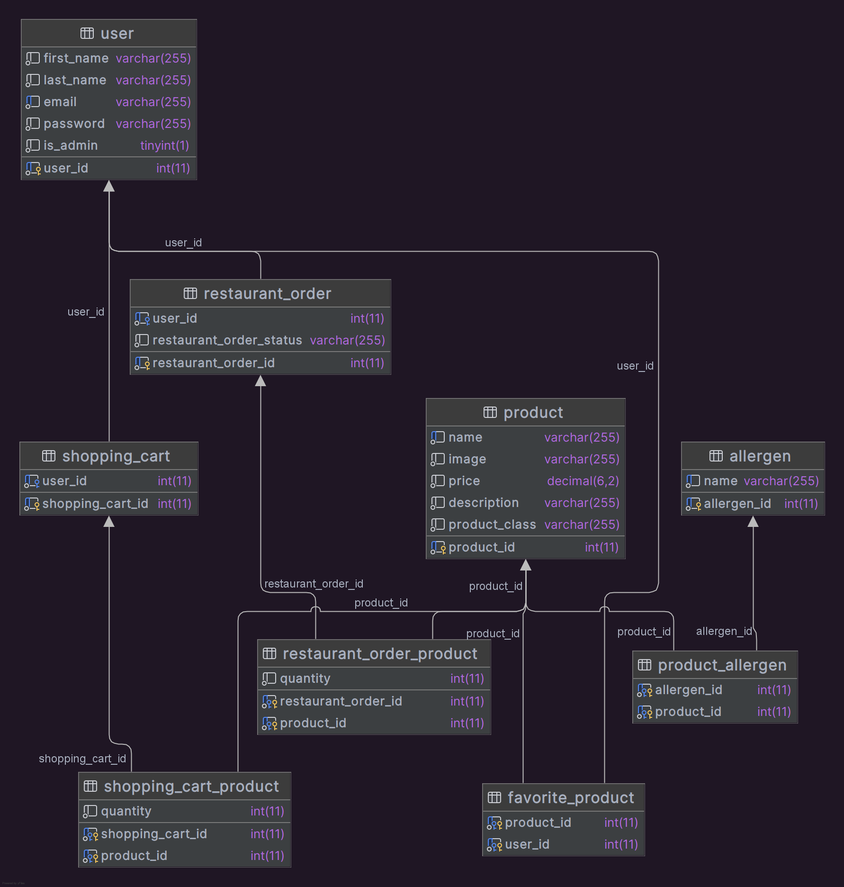

# Projektin rakenteen kuvaus

# Tietokannan kuvaus

##Taulujen väliset suhteet:
• restaurant_order all - 1 user
• restaurant_order all - all product
• shopping_cart all - 1 user
• shopping_cart all - all product
• product all - all user
• allergen all - all product

# Toiminnallisuuksien kuvaus

Shinkai on japanilaisen ravintolan tilaus/nouto sovellus.

## Kirjautumaton käyttäjä voi:

-Katsoa ruokalistaa
-Rekisteröityä käyttäjksi

## Kirjautunut käyttäjä voi:

-Tehdä kaiken mitä kirjautumaton käyttäjäkin
-Kirjautua sisään sovellukseen
-Lisätä tuotteita ostoskoriin
-Poistaa tuotteita ostoskorista
-Tilata haluamnsa tuotteet/luoda tilaus
-Nähdä tilauksensa omassa profiilissaan
-Kirjautua ulos sovelluksesta
